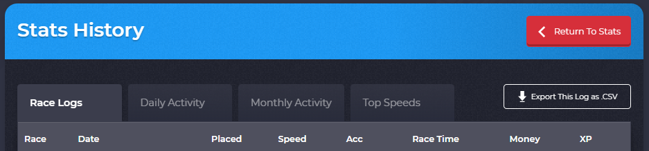
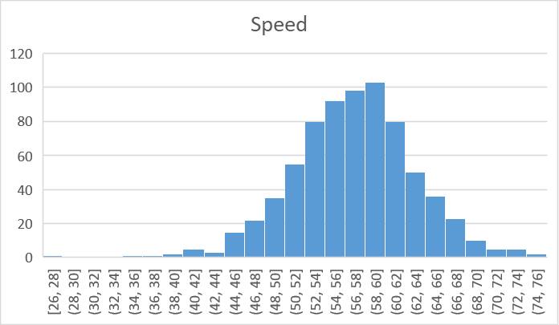
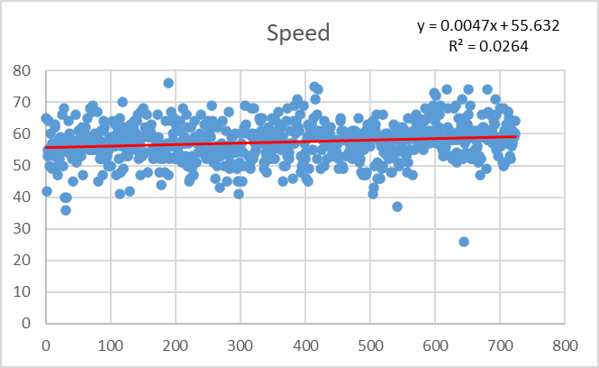
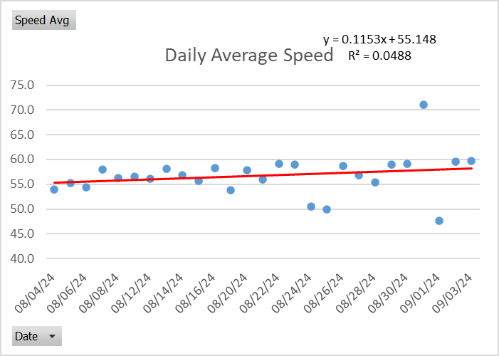

# Nitro Type Race Logs Extraction

## Extraction: UiPath

```
Exporting race logs is only for gold members!
```



The "Export this log as CSV" feature is blocked. 

### The Solution
UiPath extract the data from all the pages and store it in a CSV file. Only the race logs of the last 30 days are stored on Nitro Type, but older race logs can be stored in the CSV file. The race logs can be found on the [history](https://www.nitrotype.com/racelog/racelog) page. Duplicate logs are not saved in the CSV file. 

## Presentation: Excel
The data is imported to Excel. The data is transformed, which include the removal of unwanted units and formatting of the date and time. The data is summarised in three graphs.

### Histogram


### Scatterplot with a Trendline


### Daily Speed Average with a Trendline
