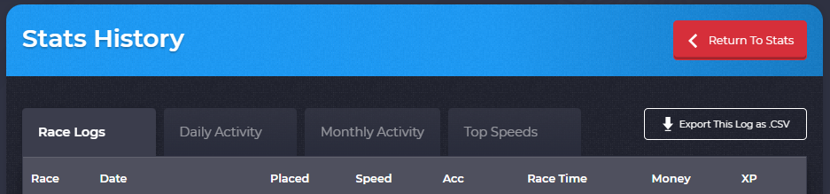
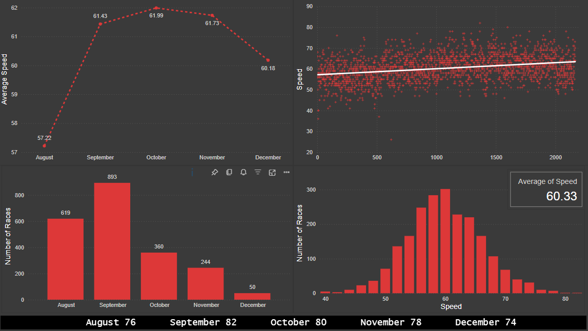
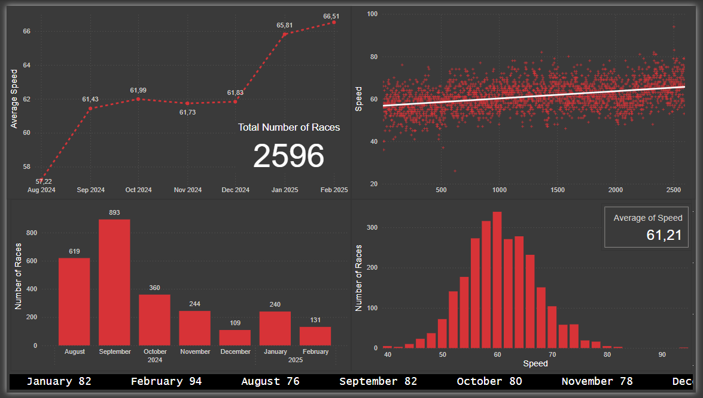
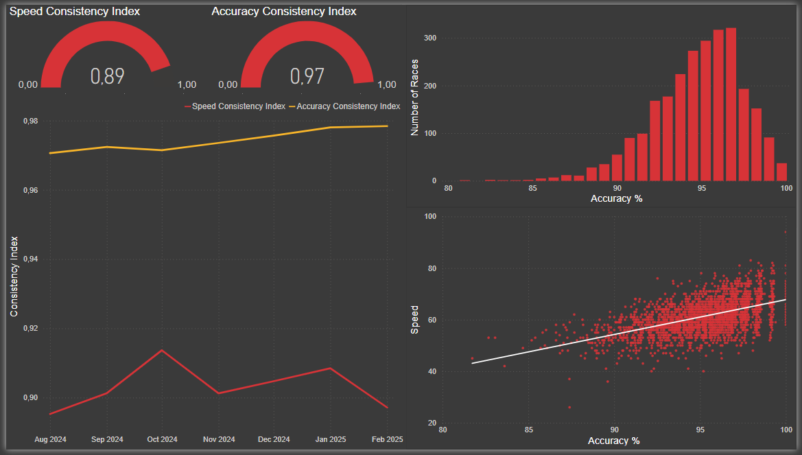
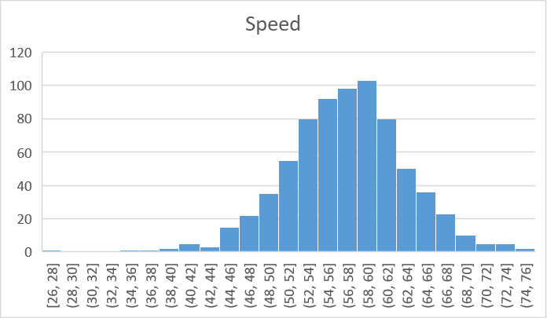
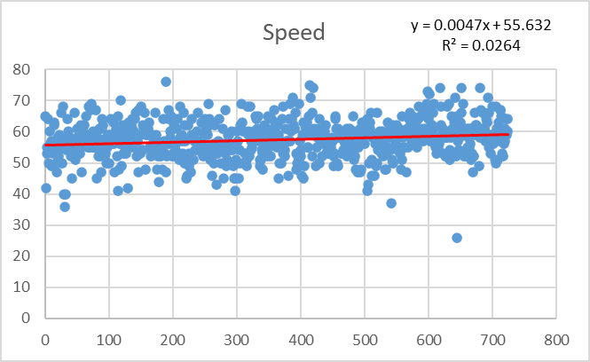
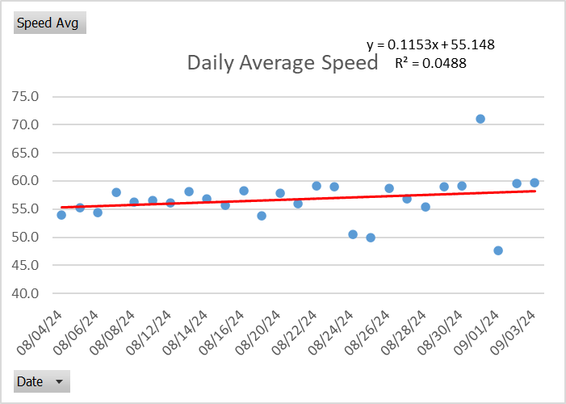

# Nitro Type Race Logs Extraction


```
Exporting race logs is only for gold members!
```



The "Export this log as CSV" feature is blocked. 

## Extraction: UiPath
UiPath extract the data from all the pages and store it in [RaceLogs.csv](RaceLogs.csv). Only the race logs of the last 30 days are stored on Nitro Type, but older race logs can be stored in the CSV file. The race logs can be found on the [history](https://www.nitrotype.com/racelog/racelog) page. Duplicate logs are not saved in the csv file. 

## Presentation: Power BI
The [link](https://app.powerbi.com/links/eCTIt4fFG1?ctid=1bedeeba-8b6d-4e9b-b4a4-18bca8bcee90&pbi_source=linkShare) to the Power BI dashboard is only accessible with the company creditentials.

<!--  \
*Figure: Power BI Dashboard.* -->

 \
*Figure: Power BI Dashboard - Page 1.*

 \
*Figure: Power BI Dashboard - Page 2.*

## Presentation: Excel
The data is imported into Excel. The data is transformed, which include the removal of unwanted units and formatting of the date and time. Similar data transformation was used to import the data from the csv file to Power BI. The Excel presentation was replaced by the Power BI presentations, which looks significantly better.

<!-- ### Histogram


### Scatterplot with a Trendline


### Daily Speed Average with a Trendline
 -->